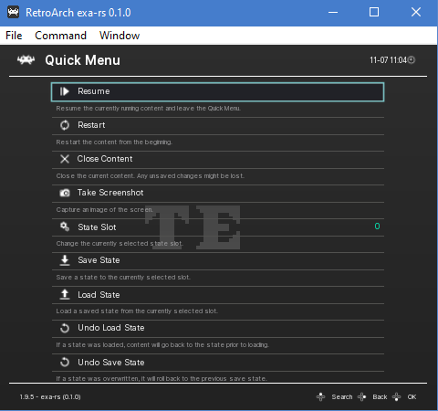
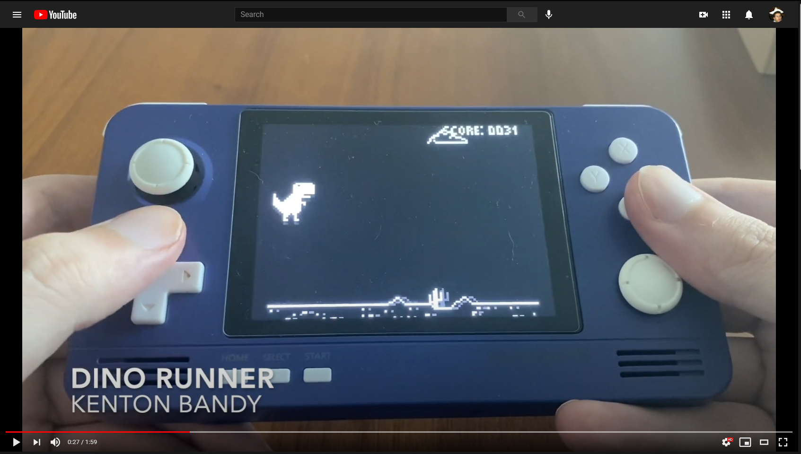
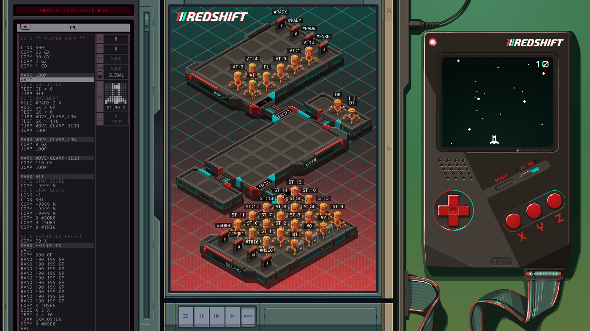
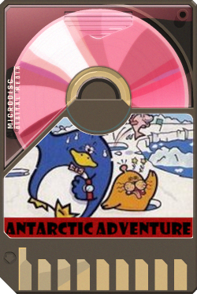

# exa-rs



*Above: 15-puzzle by Isaac Wass*

[Libretro](https://www.libretro.com/) core for the [TEC Redshift](https://store.steampowered.com/app/948420/EXAPUNKS_TEC_Redshift_Player/), a fictional video game handheld found in Zachtronics' [EXAPUNKS](https://store.steampowered.com/app/716490/EXAPUNKS/).

You can use this core to play Redshift games in your favorite libretro frontend, such as [Retroarch](https://www.retroarch.com/).

## Quick Start

Pop over to [Releases](https://github.com/thieman/exa-rs/releases) and download the latest version of the core for your architecture. Load it up in Retroarch and you're ready to play Redshift games. Check out [awesome-redshift](https://github.com/Alekhine51/awesome-redshift) to start your collection, or make your own Redshift game in EXAPUNKS (which is super fun).

## Background

### Promotional Material

The TEC Redshift is the premiere mobile gaming platform of 1992 and ships with the following features:

- Computational support for up to 64 parallel EXAs
- A 120x100 screen in gorgeous 6:5 aspect ratio. That's more than 10,000 pixels of raw visual delight
- A questionable anaglyph 3D feature (not currently implemented in the core)
- A sound system [similar to that of an NES](https://www.youtube.com/watch?v=UAf4UooMtBs). You get two square waves, a triangle wave, and some noise for drums and 'splosions
- Three glorious buttons! Redshift does what NintenDON'T

The Redshift also implements some great developer features in its hardware, making it even easier for you to hack out some games:

- Sprite support, allowing each EXA to hold a whopping 100 pixels
- A massive built-in sprite library containing more than 35 sprites
- Per-pixel collision detection on every single cycle. Bounding boxes are for chumps!

### But Really Though

The Redshift is mostly a "freeform" puzzle for people to tackle after they've gotten their fill of the puzzles in EXAPUNKS, which is a fantastic game that you should definitely play if you're the type of person who reads READMEs on GitHub for fun.

I started this project for a few reasons:

1) I had to learn Rust or I was going to lose all my programming hipster cred
2) Writing an emulator, even if it's a "fake" one, is super fun
3) I thought I had a chance at being the first person to play the Redshift on an actual handheld

Anyway, here's Wonderwall:

[](https://www.youtube.com/watch?v=ueRJOj0mBJM "TEC Redshift on Retroid Pocket 2")

## The Core

The core contains a mostly-complete implementation of the following:

- a parser for "Exa script" **(left)**
- the Exa VM **(middle)**, which hosts the Exas, Registers and Files that make up the program
- Redshift-specific extensions to the normal Exa VM, such as sprites and collision detection
- the Redshift frontend **(right)**, which combines the Exa sprites and register states to produce audio and video output, and also sends button input to the VM registers



The core is also able to load games from Redshift ROMs, which are baked into PNGs using steganography. The ROM data is stored in the LSBs of the pixels at the top of the image. Example ROM:



The core runs at 60fps, but input and video are only updated at 30 fps to match the Redshift spec. I ran into a lot of problems trying to get Retroarch to run the core itself at 30fps, but at 60fps everything went smoothly.

Unimplemented or partially complete features:
- The core does not support keywords as they are not usable for Redshift games. The `HOST` command is a no-op.
- Square and triangle waves should be pretty faithful to the reference Redshift. The Noise waveform, however, is an approximation based on downsampling white noise. It's unclear exactly how Zachtronics' Noise waveform was created.
- Saving and loading states is not implemented
- Anaglyph 3D mode is not implemented

## Building

exa-rs is written entirely in Rust. Compiling for most architectures is simple, once you have the requisite [Rust toolchain installed](https://www.rust-lang.org/tools/install):

```bash
cargo build --lib --release
```

This will place the core in `./target/release` relative to the top of the repo. The exact file name is different depending on architecture, but you're looking for something like `libexa.so` (Linux or Android), `exa.dll` (Windows), or `libexa.dylib` (Mac).

Compiling for Android is pretty difficult and requires a bit of system-specific config that `rustup` won't handle for you. If you're a Rust/Android expert and want to contribute a Makefile or something to make that easier, it'd be appreciated.

## Testing

The parser and Exa VM have unit and integration tests which can be run via `cargo test`.

There are not currently tests for the frontend, e.g. the interaction between the Exa VM and libretro.h. Frontend changes should be verified manually.

## Other Notes

This is my very first Rust project and I was learning the basics of the language as I went along. There are almost certainly some bad patterns in the code, and I think I would have laid out the data model quite differently if I knew more about Rust when I started. Quite a few things are strung together with `Rc<RefCell<T>>` and it's easy to create a runtime crash bumping up against conflicting `RefCell` borrows. 

Performance is probably quite bad as I haven't spent any time optimizing. The current performance target is 80 cycles per frame (60fps) on my Retroid Pocket 2, which runs a 1.5GHz Cortex A-7 CPU. This seems to be enough to run the games I've tried pretty well.

Also, writing Redshift games is super fun and you should try it out.

## Acknowledgements

- [Kenton Bandy](https://github.com/kentonbandy) for feeding the Redshift mania and teaching me the first thing about digital audio
- [Brian Farr](https://github.com/farrspace) for coming up with a close approximation of the Redshift Noise waveform. Turns out downsampling white noise gets you pretty close. Brian also got me to write my first Redshift game, a 2048 clone
- [Mickey Thaler](https://github.com/mithaler) for helping me out with a ton of beginner Rust questions, as well as inspiring the project through [his Rust NES emulator](https://github.com/mithaler/nes)
